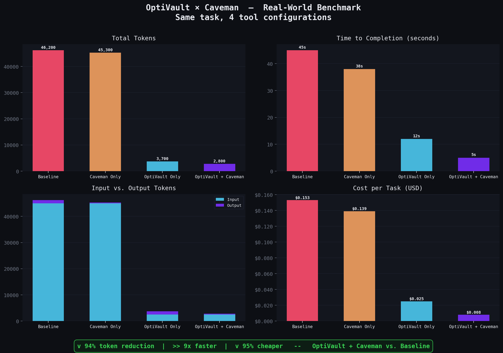

<table><tr>
<td><h1>OptiVault</h1><strong>Zero-Dependency AST-Driven Context Compiler and MCP Server for Claude Code</strong></td>
<td></td>
</tr></table>

OptiVault solves the "token bloat" problem with the most direct approach: no LLMs, no summarization, no external API calls. It extracts your repo's structure—function signatures, arrow functions, class methods, dependencies—using pure AST parsing, writes a compressed shadow vault, and exposes it via the MCP protocol.

Claude Code gets a **4-tool semantic router** to traverse your codebase hierarchically, consuming **~50 tokens per file instead of ~1,000**. As soon as Claude is done writing code, a single `sync_file_context` call keeps the vault perfectly up to date.

---

## Benchmark Results

Same task. Same codebase. Four tool configurations. Measured with Claude Code's `/cost` command.



| Scenario | Input Tokens | Output Tokens | Total Tokens | Time | Cost |
|---|---|---|---|---|---|
| Baseline (vanilla Claude) | 45,000 | 1,200 | 46,200 | 45s | $0.153 |
| Caveman Only | 45,000 | 300 | 45,300 | 38s | $0.139 |
| OptiVault Only | 2,500 | 1,200 | 3,700 | 12s | $0.025 |
| **OptiVault + Caveman** | **2,500** | **300** | **2,800** | **5s** | **$0.008** |

**v 94% token reduction · 9× faster · 95% cheaper** vs. a vanilla Claude Code session.

> Numbers above are representative mock data. Run `python benchmark/plot_results.py` after filling in `benchmark/data.csv` with your own `/cost` readings to regenerate the charts.
>
> See [`benchmark/EXPERIMENT_GUIDE.md`](benchmark/EXPERIMENT_GUIDE.md) for the exact reproduction steps.

---

## Why OptiVault

| Problem | OptiVault's Solution |
|---|---|
| Claude reads entire files to understand structure | `read_file_skeleton` returns deps + signatures in ~50 tokens |
| Context window fills with irrelevant code | `read_function_code` fetches only the function Claude needs |
| Shadow context goes stale when Claude writes code | `sync_file_context` re-indexes a single file in ~20ms |
| Claude doesn't know OptiVault exists | `optivault init` generates `CLAUDE.md` enforcing the protocol |
| Re-running `init` on a large project is slow | mtime-based caching skips unchanged files entirely |

---

## Features

- **Zero external dependencies** — no Ollama, no LLMs, no API calls. Pure TypeScript.
- **Blazing fast** — scans 1,000 files in ~2–3 seconds; incremental sync in ~20ms.
- **Full arrow function support** — `export const fn = (x: string) => {}` extracts as `fn(x: string)`, not just `fn`.
- **4-tool MCP semantic router** — bird's-eye map → file skeleton → function body → live re-sync.
- **Self-enforcing protocol** — auto-generated `CLAUDE.md` tells Claude *exactly* how to use OptiVault.
- **Idempotent init** — mtime-checked; re-running init on a 5,000-file repo takes milliseconds.
- **Plugin architecture** — add Go, Rust, or Java by implementing a single interface.
- **Obsidian-compatible vault** — default dir `_optivault` is visible in Obsidian natively (no leading dot).
- **Auto-migration** — detects and renames legacy `.optivault` directories automatically; zero data loss.
- **Configurable vault name** — drop an `optivault.json` in your project root to rename the vault dir.
- **99 passing tests** — full coverage across extraction, fallbacks, MCP tools, caching, and migration.

---

## Install

### Prerequisites

- **Node.js** ≥ 20 ([download](https://nodejs.org/))
- **npm** (comes with Node.js)

### From Source

```bash
git clone https://github.com/your-username/optivault
cd optivault
npm install
npm run build
npm link
```

`npm link` makes the `optivault` binary available globally:

```bash
optivault --help
```

---

## Quickstart

```bash
# 1. Index your project (creates _optivault/, CLAUDE.md, and .gitignore entry)
optivault init ~/my-project

# 2. Register with Claude Code
claude mcp add optivault optivault -- mcp \
  --vault ~/my-project/_optivault \
  --source ~/my-project

# 3. Open Claude Code in that project — it will read CLAUDE.md and follow the protocol automatically
```

---

## How It Works

### 1. Index (`optivault init`)

```bash
optivault init ~/my-project
```

What happens:
- Checks for a legacy `.optivault` directory and **renames it automatically** (zero data loss)
- Reads `optivault.json` for a custom vault dir name, defaults to `_optivault`
- Recursively walks the project for `.ts`, `.tsx`, `.js`, `.mjs`, `.py` files
- Skips `node_modules`, `.git`, `dist`, and the vault dir itself
- Checks mtime — only re-parses files newer than their vault note (fully idempotent)
- Extracts function signatures, arrow functions, class methods, imports
- Writes `.md` shadow notes to `~/my-project/_optivault/`
- Generates `_RepoMap.md` — master index of the entire repo
- Creates (or patches) `CLAUDE.md` with the OptiVault protocol directive
- Adds the vault dir to `.gitignore` automatically

**Example vault note** (`src/auth.ts.md`):

```markdown
---
tgt: src/auth.ts
dep: [[database]], [[crypto]]
exp: [verifyToken(token: string), hashPwd(plain: string), TokenService]
---
## Signatures
- `verifyToken(token: string)`
- `hashPwd(plain: string)`
- `TokenService`
```

**Example RepoMap** (`_RepoMap.md`):

```markdown
# RepoMap

- [[src/auth]] — exports: verifyToken(token: string), hashPwd(plain: string) — deps: database, crypto
- [[src/db/pool]] — exports: getConnection(), closePool() — deps: pg, config
- [[src/middleware/rate-limit]] — exports: rateLimiter(opts: RateLimitOpts) — deps: express, redis
```

### 2. Watch (`optivault watch`)

```bash
optivault watch ~/my-project
```

Stays running. Re-indexes files the moment they're saved. Use this during active development instead of the MCP `sync_file_context` tool.

### 3. MCP Server (`optivault mcp`)

```bash
optivault mcp --vault ~/my-project/_optivault --source ~/my-project
```

Starts the MCP server. Claude Code connects automatically once registered.

---

## The 4 MCP Tools

### `read_repo_map`

Returns the full `_RepoMap.md` — a bird's-eye view of every file, its exports, and its dependencies.

```
Claude: "What's the architecture of this repo?"
→ read_repo_map()
← # RepoMap
  - [[src/auth]] — exports: verifyToken(...), hashPwd(...) — deps: database, crypto
  - [[src/db/pool]] — exports: getConnection() — deps: pg
  ...
```

**When to use:** Always call this first. It costs ~200 tokens and gives complete structural context.

---

### `read_file_skeleton`

Returns the compressed shadow note for a specific file: deps + all exported signatures.

```
Claude: "What does src/auth.ts export?"
→ read_file_skeleton(filename: "src/auth.ts")
← ---
  tgt: src/auth.ts
  dep: [[database]], [[crypto]]
  exp: [verifyToken(token: string), hashPwd(plain: string)]
  ---
  ## Signatures
  - `verifyToken(token: string)`
  - `hashPwd(plain: string)`
```

**When to use:** After `read_repo_map` identifies the relevant file, before reading the full source.

---

### `read_function_code`

Extracts just the implementation of a named function — standard functions, arrow functions, class methods, async functions, generic functions.

```
Claude: "I need to understand how verifyToken works"
→ read_function_code(filename: "src/auth.ts", functionName: "verifyToken")
← export function verifyToken(token: string): boolean {
    const decoded = jwt.verify(token, process.env.SECRET);
    return decoded !== null;
  }
```

**When to use:** When you need the actual logic, not just the signature. Fetches ~20 lines instead of the entire 500-line file.

Requires `--source` to be set on the MCP server.

---

### `sync_file_context`

**The key to a stale-free vault.** Call this immediately after writing or modifying any source file. It re-parses the single file, overwrites its vault note, and patches its entry in `_RepoMap.md` — all in ~20ms.

```
Claude: [writes new function calculateTax to src/billing.ts]
→ sync_file_context(filename: "src/billing.ts")
← "Successfully synced shadow context for src/billing.ts."
```

`CLAUDE.md` makes this mandatory — Claude will call it autonomously after every file write.

Requires `--source` to be set on the MCP server.

---

## CLAUDE.md — The Self-Enforcing Protocol

Every time `optivault init` runs, it checks for `CLAUDE.md` in the project root:

- **Not present** → creates it
- **Present, no OptiVault section** → appends the protocol block (original content preserved)
- **Already patched** → silent no-op

Generated content:

```markdown
<!-- optivault-protocol -->
# OptiVault Protocol Active
This repository uses OptiVault for AST-compressed context.
Shadow vault: `_optivault/`

**Rules for AI Assistants:**
1. NEVER use `cat`, `grep`, or standard file reads to understand the codebase initially.
2. ALWAYS start by calling the `read_repo_map` MCP tool.
3. Use `read_file_skeleton` to view a file's dependencies and exported signatures.
4. Use `read_function_code` if you need to analyze or modify a specific function body.
5. **CRITICAL:** Whenever you modify a file or write new code, you MUST immediately call the
   `sync_file_context` MCP tool on that file to keep the shadow vault up to date.
```

The `Shadow vault:` line reflects whatever `vaultDir` is configured (default: `_optivault`).

Claude Code reads `CLAUDE.md` automatically at the start of every session. No setup required after the first `init`.

---

## Register with Claude Code

### Via CLI (recommended)

```bash
claude mcp add optivault optivault -- mcp \
  --vault /path/to/project/_optivault \
  --source /path/to/project
```

### Via settings file

Add to `~/.claude.json` (or your project-local Claude settings):

```json
{
  "mcpServers": {
    "optivault": {
      "type": "stdio",
      "command": "optivault",
      "args": [
        "mcp",
        "--vault", "/path/to/project/_optivault",
        "--source", "/path/to/project"
      ]
    }
  }
}
```

### Multiple Projects

Register a separate MCP server per project with unique names:

```bash
claude mcp add optivault-api optivault -- mcp \
  --vault ~/projects/api/_optivault --source ~/projects/api

claude mcp add optivault-frontend optivault -- mcp \
  --vault ~/projects/frontend/_optivault --source ~/projects/frontend
```

---

## CLI Reference

### `optivault init [dir] [options]`

Index a project. Safe to re-run — unchanged files are skipped.

```bash
optivault init ~/my-project
optivault init ~/my-project --output ~/my-project/_optivault
```

| Option | Default | Description |
|---|---|---|
| `-o, --output <path>` | from `optivault.json`, else `_optivault` | Output directory for vault notes |

### `optivault watch [dir] [options]`

Watch for file changes and update incrementally. Press `Ctrl+C` to stop.

```bash
optivault watch ~/my-project
```

| Option | Default | Description |
|---|---|---|
| `-o, --output <path>` | from `optivault.json`, else `_optivault` | Output directory for vault notes |

### `optivault mcp [options]`

Start the MCP server (4 tools).

```bash
optivault mcp --vault ~/my-project/_optivault --source ~/my-project
```

| Option | Default | Description |
|---|---|---|
| `-o, --vault <path>` | from `optivault.json`, else `_optivault` | Vault directory to serve |
| `-s, --source <path>` | — | Source root (required for `read_function_code` and `sync_file_context`) |

---

## Architecture

```
src/
├── config.ts               # getConfig — reads optivault.json, returns OptiVaultConfig
├── ast/
│   ├── plugins/
│   │   ├── typescript.ts   # .ts .tsx .js .mjs .jsx — imports, exports, arrow fns, methods
│   │   ├── python.ts       # .py — top-level defs, classes, imports
│   │   └── index.ts        # Auto-registers all built-in plugins
│   ├── extractor.ts        # Public extractDeps / extractExports API
│   ├── function-extractor.ts  # extractFunctionCode — brace-matched body extraction
│   ├── parser.ts           # parseFile — reads file, dispatches to plugin
│   ├── registry.ts         # Plugin registry — keyed by file extension
│   └── types.ts            # LanguagePlugin interface
├── compression/
│   └── formatter.ts        # formatVaultNote — ParseResult → .md frontmatter
├── vault/
│   ├── init.ts             # walkDir, runInit, migrateLegacyVault, generateClaudeMd,
│   │                       #   ensureGitignored, VaultRegistry
│   └── watch.ts            # chokidar watcher, incremental re-index
├── mcp/
│   └── server.ts           # McpServer with 4 tools
└── cli/
    └── index.ts            # Commander CLI — init / watch / mcp (all consume getConfig)
```

### Plugin Interface

```typescript
interface LanguagePlugin {
  extensions: string[];
  extractDeps(source: string): string[];
  extractExports(source: string): string[];
  extractFunctionCode?(source: string, functionName: string): string | null;
}
```

### Adding a New Language

```typescript
// src/ast/plugins/go.ts
import type { LanguagePlugin } from '../types.js';

export const goPlugin: LanguagePlugin = {
  extensions: ['.go'],
  extractDeps(source) {
    // Extract import paths → ["fmt", "os", "github.com/user/pkg"]
    return [];
  },
  extractExports(source) {
    // Extract exported func signatures → ["main()", "InitDB(): error"]
    return [];
  },
  extractFunctionCode(source, functionName) {
    // Return the full function body or null
    return null;
  },
};
```

Register it in `src/ast/plugins/index.ts`:

```typescript
import { goPlugin } from './go.js';
registerPlugin(goPlugin);
```

Done. Zero changes to core code.

---

## Performance

| Operation | Time |
|---|---|
| Initial scan — 1,000 files | ~2–3 seconds |
| Idempotent re-scan (all unchanged) | < 100ms |
| `sync_file_context` (single file) | ~20ms |
| Incremental watch (single file save) | ~100–200ms |
| Token cost per file (skeleton) | ~50 tokens |
| Token savings vs. full file read | ~95% |

---

## Configuration

Create an `optivault.json` file in your project root to override the vault directory name:

```json
{
  "vaultDir": "_my_custom_vault"
}
```

Resolution order (highest priority first):

1. `--output` / `--vault` CLI flag
2. `vaultDir` in `optivault.json`
3. Built-in default: `_optivault`

The config file is read by `init`, `watch`, and `mcp` commands automatically — no flags needed once it exists.

---

## Use with Obsidian

The `_optivault/` directory is a fully functional Obsidian vault, visible natively without any plugins:

1. Open Obsidian → **Open folder as vault** → select `_optivault/`
2. Every source file is a note, wikilinked via its imports
3. Open **Graph View** to visualize your entire codebase as a dependency graph

> **Note:** The previous `.optivault` default used a leading dot, which Obsidian silently ignores. The new default `_optivault` is always visible.

---

## Testing

```bash
npm test            # Run full suite (99 tests)
npm run test:watch  # Continuous mode during development
npm run build       # TypeScript compilation check
npm run lint        # Type check without emit
```

Test coverage includes:

- TypeScript dep/export extraction — named, default, namespace, dynamic imports
- Arrow function signature extraction (`export const fn = (x: T) => {}`)
- Python dep/export extraction
- `extractFunctionCode` for TS standard functions, arrow functions, class methods, Python defs
- `getConfig` — missing file, malformed JSON, empty vaultDir, whitespace trimming
- `runInit` — graceful fallback on parse errors, empty projects, mtime caching
- `generateClaudeMd` — create, append, idempotent no-op, custom vault dir name
- `ensureGitignored` — create, append, idempotent no-op
- `migrateLegacyVault` — rename, no legacy dir, identical paths, both dirs exist guard
- All 4 MCP tools — registration, happy path, ENOENT handling, `sync_file_context` patch/insert/replace logic

---

## FAQ

**Why regex instead of tree-sitter?**
Regex extraction requires zero native build steps, works in every environment, and is fast enough for all practical repo sizes. Individual plugins can be upgraded to tree-sitter incrementally without touching the core.

**Does `read_function_code` handle generics?**
Yes. `function fn<T = unknown>(x: T)` is matched correctly. Brace-depth tracking handles nested generics, strings, and template literals.

**What if a file can't be parsed?**
`init` logs a warning and skips it. The rest of the index is unaffected and the process does not crash.

**What if `CLAUDE.md` already exists?**
OptiVault appends only if the `<!-- optivault-protocol -->` marker is absent. Your existing content is never touched.

**Can I run this offline?**
Yes. 100% offline. No network calls, no API keys, no LLM backends.

**Does `sync_file_context` rebuild the entire RepoMap?**
No. It reads the existing `_RepoMap.md`, replaces or inserts just the one changed line, and writes it back. It's an O(lines in map) patch, not an O(files in repo) rebuild.

**What languages are supported?**
TypeScript, TSX, JavaScript, MJS, JSX, and Python out of the box. Any language can be added via the plugin interface.

**I have an old `.optivault` directory. Do I need to rename it manually?**
No. The first time you run `optivault init` (or `watch` or `mcp`) after upgrading, OptiVault detects the legacy `.optivault` directory and renames it to `_optivault` automatically. No data is lost.

**Why `_optivault` instead of `.optivault`?**
Obsidian natively ignores any directory whose name starts with a dot. The `_optivault` default is fully visible in Obsidian's file explorer and Graph View without any plugins or workarounds.

**Does OptiVault touch `.gitignore`?**
Yes — `optivault init` appends the vault dir name to `.gitignore` if it isn't already there. It creates `.gitignore` if the file doesn't exist. It is always a no-op if the entry is already present.

---

## License

MIT

---

**Built for Claude Code. Built for speed. Built for clarity.**
